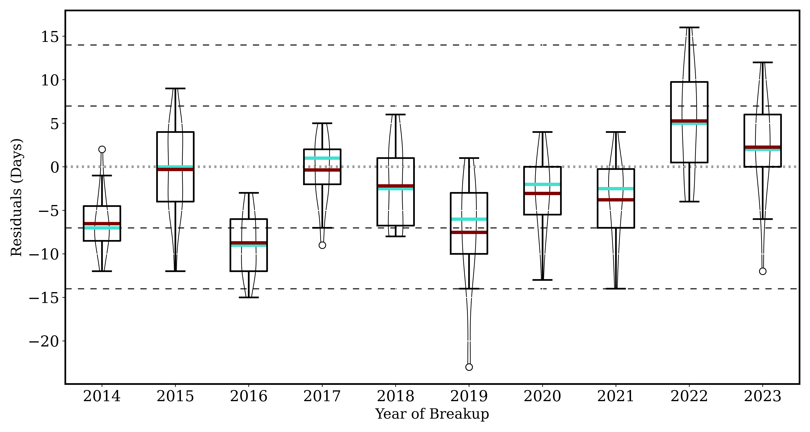
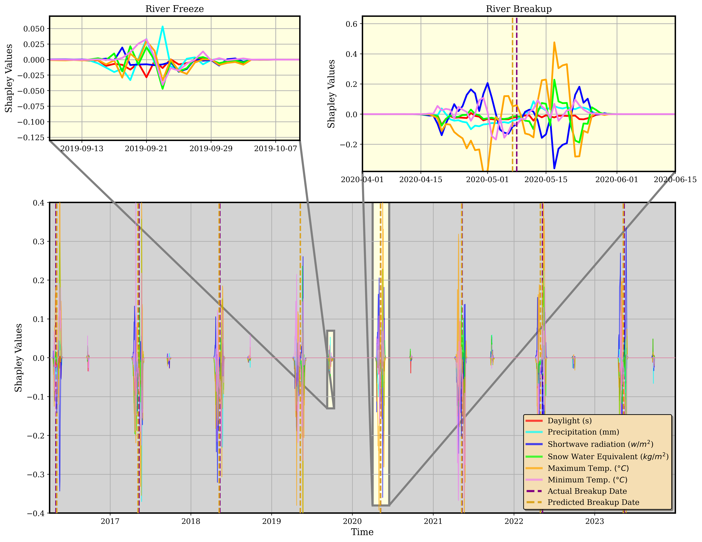

# River Ice Breakup Prediction Using Deep Learning

## Overview

Predicting the timing of annual river ice breakup is crucial for residents to prepare for potential flooding and assess the safety of transportation along rivers.  
This project develops a deep learning approach leveraging meteorological and geospatial data products to forecast river ice breakup dates.

We applied a Long Short-Term Memory (LSTM) model using daily meteorological data and static watershed attributes across 33 locations along eight major rivers in Alaska, USA, and Western Canada.  
Additionally, we explored the model’s ability to predict future breakup dates using operational long-range weather forecasts.

---

## Study Locations

Below is a map showing the river locations analyzed along eight major rivers in Alaska and Western Canada:


---

## Key Details

- **Locations**: 33 river sites (Alaska and Western Canada) 
- **Breakup Dates**: Sourced from Alaska-Pacific River Forecast Center database  
- **Meteorological Data**: Daily inputs from Daymet  
- **Watershed Attributes**: Static features from the pan-Arctic Catchment Database  
- **Model**: Long Short-Term Memory (LSTM)  
- **Holdout Evaluation**:  
  - 23 locations used for training  
  - 10 locations reserved for testing generalizability over space (Holdouts)

---

## Model Performance

| Metric | Training Locations | Holdout Locations |
|:------:|:------------------:|:-----------------:|
| Mean Absolute Error (MAE) | 5.40 days | 8.46 days |
| Standard Deviation of Error | 4.03 days | 6.64 days |
| Mean Absolute Percentage Error (MAPE) | 4.37% | 6.92% |

**Temporal Range**: 1980–2023  

Below are boxplots showing prediction performance across the test locations:



---

## Seasonal Forecast Application

We retrieved **51 long-range seasonal forecast ensembles** from the Copernicus Climate Data Store and applied the trained LSTM to these datasets.  
This demonstrates the model's capability for **operational forecasting** of river ice breakup.

---

## Feature Attribution

We computed **Shapley values** to assess the marginal contribution of each input variable to the breakup predictions.  
A **new temporal correction scheme** was developed and applied to the Shapley values to account for unique temporal features in river breakup events.

Below is a visualization of the temporally adjusted Shapley values:



---

## Unique Methodological Notes

To improve model initialization and convergence, we introduced a bias into the kernel initialization using the following equations:
$P(Breakup) = \frac{TP}{TN + TP} = \frac{1}{1 + e^{\mathrm{-Bias_0}}}$
$Bias_0 = -\ln\left(\frac{1}{\mathrm{P(Breakup)} - 1}\right) = \ln\left(\mathrm{\frac{TP}{TN}}\right)$

This bias correction positioned the LSTM to effectively forecast infrequent events in nature - in this instance, the breakup timing of Arctic river ice.

---

## Authors and Affiliations

- [Russ Limber](https://www.ornl.gov/staff-profile/russell-limber) — The University of Tennessee, Knoxville, TN, USA; Oak Ridge National Laboratory, Oak Ridge, TN, USA
- [Forrest M. Hoffman](https://www.ornl.gov/staff-profile/forrest-hoffman) — Oak Ridge National Laboratory, Oak Ridge, TN, USA
- [Jon Schwenk](https://laro.lanl.gov/esploro/profile/jonathan_schwenk/output/all?institution=01LANL_INST) — Los Alamos National Laboratory, Los Alamos, NM, USA
- [Jitendra Kumar](https://www.ornl.gov/staff-profile/jitendra-kumar) — Oak Ridge National Laboratory, Oak Ridge, TN, USA

---

## Publication

This work is currently under review in [Water Resources Research](https://www.authorea.com/users/809484/articles/1283660-long-short-term-memory-model-to-forecast-river-ice-breakup-throughout-alaska-usa).

---

## Acknowledgment

This work was supported by the U.S. Department of Energy, Office of Science, Biological and 
Environmental Research (BER) Regional and Global Model Analysis (RGMA) program, as part of The 
Interdisciplinary Research for Arctic Coastal Environments (InteRFACE) project and the Reducing 
Uncertainties in Biogeochemical Interactions through Synthesis and Computation (RUBISCO) 
Science Focus Area. This research used resources of the National Energy Research Scientific 
Computing Center (NERSC), a Department of Energy Office of Science User Facility under projects 
m3958 and m2467 (2025). This manuscript has been authored in part by UT-Battelle, LLC, under 
contract DE-AC05-00OR22725 with the US Department of Energy (DOE). The publisher acknowledges 
the US government license to provide public access under the DOE Public Access Plan (http://
energy.gov/downloads/doe-public-access-plan).

---

## How to Cite

If you use this work or the provided code, please cite:

<!-- **Bibtex**:
```bibtex
@INPROCEEDINGS{Limber2024,
	author={Limber, Russ and Hargrove, William W. and Hoffman, Forrest M. and Kumar, Jitendra},
	booktitle={2024 IEEE International Conference on Big Data (BigData)}, 
	title={Forecast of Wildfire Potential Across California USA Using a Transformer}, 
	year={2024},
	volume={},
	number={},
	pages={4342-4350},
	keywords={Surveys;Wildfires;Normalized difference vegetation index;Geology;Weather forecasting;Predictive models;Transformers;Fuels;Indexes;MODIS;transformer;residual connection;wildfires;time series;remote sensing},
	doi={10.1109/BigData62323.2024.10825778}}
``` -->
(permanent citation coming soon)
```
Russ Limber, Forrest M Hoffman, Jon Schwenk, et al. Long Short-Term Memory Model to Forecast River Ice Breakup Throughout Alaska USA. Authorea. April 07, 2025. DOI: 10.22541/au.174405211.12366502/v1
```

